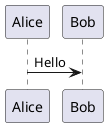

# MDoc

MDoc is a FOSS markdown-based document previewer and PDF exporter for technical documents.

It supports paged A4 preview and export, PlantUML diagrams rendered as bitmaps, TeX formulas rendered as bitmaps, tables, a title page, a generated table of contents, and manual page breaks.

## Features

- Split desktop UI: source editor on the left, paged preview on the right
- A4 preview with page shadows
- PDF export with embedded fonts
- Markdown tables with repeated table headers across pages
- Fenced `plantuml` / `puml` blocks
- Fenced `tex` blocks
- Title page from the first `# Title: ...` block up to the first `# TOC` or the next `# Title: ...`
- Generated table of contents from headings
- Manual page breaks with `<!-- pagebreak -->`
- CLI export mode without starting the GUI

## Document conventions

### Title page

```markdown
# Title: My Document Title

Optional markdown content for the title page.

# TOC
```

Everything between the first `# Title:` and the first `# TOC` is treated as the title page.  
If a second `# Title:` appears before `# TOC`, the title page ends before that second marker.

### Table of contents

```markdown
# TOC
```

Only the first `# TOC` is treated specially.

### Manual page break

```html
<!-- pagebreak -->
```

Keyboard shortcut in the editor: `Ctrl + Enter`

### PlantUML

````markdown

````

### TeX

````markdown
```tex
\frac{a+b}{c}
```
````

## Running from source

The project uses a local `.venv`.

### Start the GUI

```bash
./run.sh path/to/document.md
```

### Export a PDF from the command line

```bash
./run.sh --export-pdf path/to/document.md -o output.pdf
```

If no output path is given, the PDF is written next to the input file with the `.pdf` extension.

## Building a standalone executable

```bash
./build.sh
```

The resulting binary is placed in `dist/`.

## Additional software required for full functionality

Install these on the system if you want all rendering features:

- Python 3.10+
- Java Runtime Environment
- PlantUML
- Graphviz
- DejaVu fonts

Without PlantUML and Graphviz, PlantUML blocks cannot render.  
Without DejaVu fonts, PDF export will fail because embedded fonts are required.

## Notes

- `Tab` inserts 8 spaces.
- Completion popup is available with `Ctrl + Space` inside fenced code blocks only.
- The preview and the editor are intentionally not synchronized.

## License

MIT License. See `LICENSE`.
