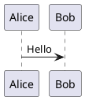
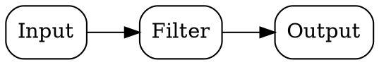

# MDoc


MDoc is a free and open-source Markdown document editor, live previewer, and PDF exporter for technical documentation.

It is built for software developers who want documents that stay readable as plain text, render cleanly for humans, and remain understandable to AI coding agents.

# DISCLAIMER

THIS IS A FUNCTIONAL PROTOTYPE.

THE SOFTWARE IS PROVIDED "AS IS", WITHOUT WARRANTY OF ANY KIND, EXPRESS OR
IMPLIED, INCLUDING BUT NOT LIMITED TO THE WARRANTIES OF MERCHANTABILITY,
FITNESS FOR A PARTICULAR PURPOSE AND NONINFRINGEMENT. IN NO EVENT SHALL THE
AUTHORS OR COPYRIGHT HOLDERS BE LIABLE FOR ANY CLAIM, DAMAGES OR OTHER
LIABILITY, WHETHER IN AN ACTION OF CONTRACT, TORT OR OTHERWISE, ARISING FROM,
OUT OF OR IN CONNECTION WITH THE SOFTWARE OR THE USE OR OTHER DEALINGS IN THE
SOFTWARE.

# Why MDoc

MDoc helps teams write textual technical documentation that works for both machines and people.

Diagrams are stored as PlantUML and Graphviz/DOT text, so software structure, flows, and links remain visible in Git diffs and readable by AI coding agents. The same source can still become a real PDF for meetings, manuals, reports, papers, and enterprise review processes. It is a practical bridge between engineering systems and human-facing documents.

# Features

- Markdown editing with live document preview
- PDF export from the GUI and command line
- PlantUML code blocks for UML diagrams
- Graphviz/DOT code blocks for structure and flow diagrams
- TeX code blocks for formulas
- Title page support
- Table of contents generated from document headings
- Manual page breaks
- Syntax highlighting in the editor
- Completion inside diagram and formula code blocks with `Ctrl` + `Space`
- Nested code blocks
- Tables moved to a new page with the heading repeated
- Embedded fonts and rendered images in exported PDFs

# Document Syntax

## Title Page

```markdown
# Title: My Document Title

Optional markdown content for the title page.

# TOC
```

Everything between the first `# Title:` and the first `# TOC` is treated as the title page.
If a second `# Title:` appears before `# TOC`, the title page ends before that second marker.

## Table Of Contents

```markdown
# TOC
```

Only the first `# TOC` is treated specially.

## Manual Page Break

```html
<!-- pagebreak -->
```

Keyboard shortcut in the editor: `Ctrl` + `Enter`.

## PlantUML

````markdown

````

While editing inside the block, press `Ctrl` + `Space` to complete.

## Graphviz / DOT

````markdown

````

Aliases: `dot`, `gv`.

While editing inside the block, press `Ctrl` + `Space` to complete.

## TeX

````markdown
```tex
\frac{a+b}{c}
```
````

While editing inside the block, press `Ctrl` + `Space` to complete.

# Command Line Export

```bash
mdoc --export-pdf path/to/document.md -o output.pdf
```

If no output path is given, the PDF is written next to the input file with the `.pdf` extension.

# Release Bundles

GitHub Actions builds one-directory release archives for:

- Windows x86_64
- Windows ARM
- Linux x86_64
- Linux ARM
- macOS x86_64
- macOS Apple Silicon

Release bundles include the runtime payload needed for rendering and PDF export.

# Manual Build

The build creates a deployable one-directory PyInstaller bundle in `dist/MDoc`.

## Linux

1. Install system packages.

- Ubuntu / Debian:

```bash
sudo apt update
sudo apt install -y python3 python3-venv python3-pip \
         default-jdk-headless graphviz curl
```

- Fedora:

```bash
sudo dnf install -y python3 python3-pip \
         java-latest-openjdk graphviz curl
```

- Arch:

```bash
sudo pacman -Syu --needed python python-pip jdk-openjdk graphviz curl
```

2. Build the bundle.

```bash
./build.sh
```

3. Run the built application.

```bash
./dist/MDoc/MDoc
```

4. Optionally install it system-wide.

```bash
./install.sh
```

## Windows

1. Install Python 3.11+.

2. Install Graphviz.

```powershell
choco install graphviz -y
```

3. Install Java 21.

```powershell
choco install microsoft-openjdk --version=21.0.7 -y
```

4. Download PlantUML.

```powershell
New-Item -ItemType Directory -Force third_party/plantuml
Invoke-WebRequest `
  -Uri "https://github.com/plantuml/plantuml/releases/\
               download/v1.2025.2/plantuml-1.2025.2.jar" `
  -OutFile "third_party/plantuml/plantuml.jar"
```

5. Build the bundle.

```powershell
python -m pip install --upgrade pip
python -m pip install -r requirements.txt pyinstaller
pyinstaller --noconfirm --clean mdoc.spec
python scripts/ci/prune_bundle.py
$env:GRAPHVIZ_DOT = "C:\Program Files\Graphviz\bin\dot.exe"
$env:JAVA_BIN = (Get-Command java).Source
python scripts/ci/postbuild_bundle.py
```

6. Run the built application.

```powershell
.\dist\MDoc\MDoc.exe
```

## macOS

1. Install Python 3.11+.

2. Install Graphviz and Java.

```bash
brew install graphviz openjdk@21
```

3. Download PlantUML.

```bash
mkdir -p third_party/plantuml
curl -fsSL -o third_party/plantuml/plantuml.jar \
  "https://github.com/plantuml/plantuml/ \
   releases/download/v1.2025.2/plantuml-1.2025.2.jar"
```

4. Build the bundle.

```bash
python3 -m venv .venv
source .venv/bin/activate
python -m pip install --upgrade pip
python -m pip install -r requirements.txt pyinstaller
pyinstaller --noconfirm --clean mdoc.spec
python scripts/ci/prune_bundle.py
GRAPHVIZ_DOT="$(command -v dot)" JAVA_BIN="$(command -v java)" \
   python scripts/ci/postbuild_bundle.py
```

5. Run the built application.

```bash
open dist/MDoc.app
```

## Helper Scripts

- `run.sh` runs the current project code from the repo checkout.
- `build.sh` builds the deployable bundle in `dist/MDoc`.
- `install.sh` builds the Linux bundle and installs it into `/opt/MDoc` with a `mdoc` symlink in `/usr/local/bin`.
