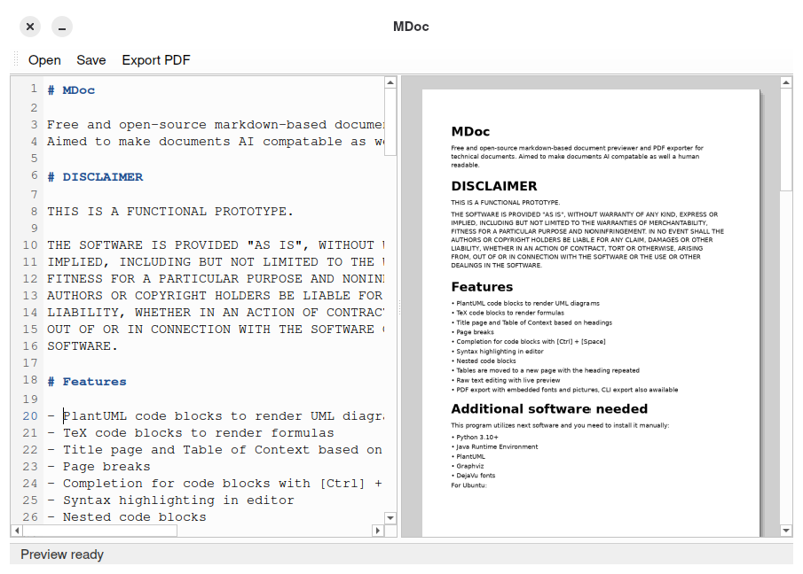
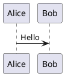

# MDoc

        

Free and open-source markdown-based document previewer and PDF exporter for technical documents.
Aimed to make documents AI compatable as well a human readable.

# DISCLAIMER

THIS IS A FUNCTIONAL PROTOTYPE.

THE SOFTWARE IS PROVIDED "AS IS", WITHOUT WARRANTY OF ANY KIND, EXPRESS OR
IMPLIED, INCLUDING BUT NOT LIMITED TO THE WARRANTIES OF MERCHANTABILITY,
FITNESS FOR A PARTICULAR PURPOSE AND NONINFRINGEMENT. IN NO EVENT SHALL THE
AUTHORS OR COPYRIGHT HOLDERS BE LIABLE FOR ANY CLAIM, DAMAGES OR OTHER
LIABILITY, WHETHER IN AN ACTION OF CONTRACT, TORT OR OTHERWISE, ARISING FROM,
OUT OF OR IN CONNECTION WITH THE SOFTWARE OR THE USE OR OTHER DEALINGS IN THE
SOFTWARE.

# Features

- PlantUML code blocks to render UML diagrams
- TeX code blocks to render formulas
- Title page and Table of Context based on headings
- Page breaks
- Completion for code blocks with [Ctrl] + [Space]
- Syntax highlighting in editor
- Nested code blocks
- Tables are moved to a new page with the heading repeated
- Raw text editing with live preview
- PDF export with embedded fonts and pictures, CLI export also awailable

# Additional software needed

This program utilizes next software and you need to install it manually:
- Python 3.10+
- Java Runtime Environment
- PlantUML
- Graphviz
- DejaVu fonts

For Ubuntu:
```
sudo apt update

sudo apt install -y \
    python3 \
    python3-venv \
    python3-pip \
    default-jre \
    plantuml \
    graphviz \
    fonts-dejavu
```

Debian:
```
sudo apt update

sudo apt install -y \
    python3 \
    python3-venv \
    python3-pip \
    default-jre \
    plantuml \
    graphviz \
    fonts-dejavu
```

Fedora:
```
sudo dnf install -y \
    python3 \
    python3-pip \
    java-latest-openjdk \
    plantuml \
    graphviz \
    dejavu-sans-fonts \
    dejavu-serif-fonts \
    dejavu-sans-mono-fonts
```

Arch:
```
sudo pacman -Syu --needed \
    python \
    python-pip \
    jre-openjdk \
    plantuml \
    graphviz \
    ttf-dejavu
```

# Build and run

Use the following scripts:
- build.sh makes deployable single-file executable
- run.sh just runst the current project code
- install.sh builds the application and copies it to /usr/bin

# Features overview

## Title page

```markdown
# Title: My Document Title

Optional markdown content for the title page.

# TOC
```

Everything between the first `# Title:` and the first `# TOC` is treated as the title page.  
If a second `# Title:` appears before `# TOC`, the title page ends before that second marker.

## Table of contents

```markdown
# TOC
```

Only the first `# TOC` is treated specially.

## Manual page break

```html
<!-- pagebreak -->
```

Keyboard shortcut in the editor: [Ctrl] + [Enter]

## PlantUML

````markdown

````

While editing inside the block press [Ctrl] + [Space] to complete.

## TeX

````markdown
```tex
\frac{a+b}{c}
```
````

While editing inside the block press [Ctrl] + [Space] to complete.


## Export a PDF from the command line

```bash
mdoc --export-pdf path/to/document.md -o output.pdf
```

If no output path is given, the PDF is written next to the input file with the `.pdf` extension.